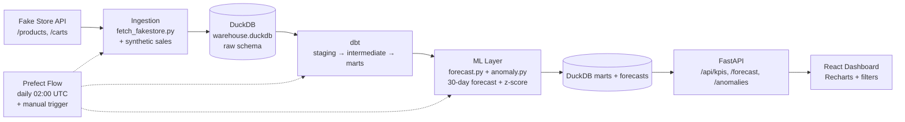

# E-Commerce Demand Forecasting Platform

Automated data pipeline + ML-enhanced dashboard for **demand forecasting & anomaly detection** — built for a BI/Data portfolio. Demonstrates ingestion → warehouse → dbt → forecasting → API → dashboard → orchestration.

> **Stack:** Fake Store API → DuckDB (BigQuery/Snowflake-ready) → dbt → statsmodels (Holt-Winters) → FastAPI → React + Recharts → Prefect → Docker Compose

---

## Architecture



### Data Flow

1. **Extract** (`ingestion/fetch_fakestore.py`): Pulls `products` and `carts` from `https://fakestoreapi.com`. Since the API has no historical time-series, we **synthesize 180 days of daily sales** per product (seeded, reproducible) with: base demand by category × trend × weekly seasonality (weekend lift) × monthly noise + Poisson sampling. This gives realistic series to forecast.
2. **Load** (`ingestion/load_duckdb.py`): Writes raw JSON → `data/raw/` and upserts into DuckDB `raw.products`, `raw.carts`, `raw.daily_sales` (DuckDB simulates BigQuery/Snowflake; swap via `dbt profiles.yml`).
3. **Transform** (`warehouse/models/`): dbt layers:
   - `staging`: `stg_products`, `stg_carts`, `stg_sales` (clean, cast, deduplicate)
   - `intermediate`: `int_daily_sales` (joined daily grain), `int_product_enriched`
   - `marts`: `mart_daily_sales` (date × product × category), `mart_category_daily`, `mart_kpi_summary`
   - Tests: `not_null`, `unique`, `relationships`, `accepted_values`
4. **Forecast** (`ml/forecast.py`): Per product & per category, fits **Holt-Winters ExponentialSmoothing** (trend + seasonal period=7) via `statsmodels`. Falls back to seasonal-naive/rolling mean if insufficient history. Outputs 7–30 day forecast with 95% confidence intervals (residual std × 1.96).
5. **Anomaly** (`ml/anomaly.py`): Z-score on `actual vs rolling 14-day mean` and `actual vs forecast residual`. Flags `|z| > 2.5` as anomaly. Stored in `mart_anomalies`.
6. **Serve** (`api/main.py`): FastAPI reads DuckDB marts + forecast parquet/csv, serves KPIs, trends, forecasts, anomalies.
7. **Visualize** (`dashboard/`): React (Vite) + Recharts: sales trends, forecast with CI band, anomaly dots, filters by category/product/date.
8. **Orchestrate** (`orchestration/flow.py`): Prefect flow `ecommerce_pipeline` chains: `extract → load → dbt run → retrain forecast`. Scheduled daily 02:00 UTC, triggerable via `prefect deployment run` or API.

### Why these choices?

| Decision | Choice | Why | Swap path |
|---|---|---|---|
| **API** | Fake Store API + synthetic history | Free, no key, e-commerce semantics; real sales history doesn't exist publicly so synthesis is honest & explainable in interview | Replace `synthesize.py` with Shopify/Stripe connector |
| **Warehouse** | **DuckDB** (file `data/warehouse.duckdb`) | Zero-ops, runs anywhere, Postgres-compatible SQL, <1s queries for portfolio scale, interview-friendly | Change `warehouse/profiles.yml` target to `bigquery`/`snowflake` — dbt models are ANSI SQL, no rewrite |
| **Dashboard** | **React + Vite + Recharts** (you chose React) | Shows full-stack ability beyond Streamlit; still fast (Vite) | Streamlit version is 1-file alternative in `docs/` |
| **Forecast** | Holt-Winters (statsmodels) | Explainable vs Prophet (heavy, pystan): you can whiteboard ETS equations, seasonal period=7 is intuitive, CI is transparent | Swap to `prophet` by replacing `fit_forecast()` |
| **Orchestration** | Prefect 2.x | Lighter than Airflow, Python-native, no DAG boilerplate, local + cloud | Airflow DAG is trivial port |

---

## Project Structure

```
.
├── ingestion/              # Extract + synthetic + load
│   ├── config.py
│   ├── fetch_fakestore.py
│   ├── synthesize.py
│   └── load_duckdb.py
├── warehouse/              # dbt project (DuckDB adapter)
│   ├── dbt_project.yml
│   ├── profiles.yml
│   └── models/
│       ├── staging/
│       ├── intermediate/
│       └── marts/
├── ml/                     # Forecasting + anomaly
│   ├── forecast.py
│   ├── anomaly.py
│   └── train.py
├── api/                    # FastAPI backend
│   └── main.py
├── dashboard/              # React + Vite frontend
│   ├── package.json
│   └── src/
├── orchestration/
│   └── flow.py             # Prefect flow
├── tests/                  # pytest
├── scripts/
│   ├── init_db.py
│   └── run_pipeline.py
├── data/                   # gitignored: raw/, warehouse.duckdb, forecasts/
├── docker-compose.yml
├── pyproject.toml
└── README.md
```

---

## Quickstart (Local, no Docker)

```bash
# 1. Clone & env
python -m venv .venv
# Windows: .venv\Scripts\activate  |  Mac/Linux: source .venv/bin/activate
pip install -r requirements.txt
cp .env.example .env

# 2. Run pipeline once (ingest → DuckDB → dbt → forecast)
python scripts/run_pipeline.py
# or step-by-step:
python -m ingestion.fetch_fakestore
python -m ingestion.load_duckdb
cd warehouse && dbt build --profiles-dir . && cd ..
python -m ml.train

# 3. Start API
uvicorn api.main:app --reload --port 8000
# → http://localhost:8000/docs  (Swagger)

# 4. Start dashboard (new terminal)
cd dashboard
npm install
npm run dev
# → http://localhost:5173

# 5. Prefect (optional, local)
prefect server start   # in one terminal
python orchestration/flow.py  # manual run
# schedule: prefect deployment build orchestration/flow.py:ecommerce_pipeline -n daily --cron "0 2 * * *" --apply
```

## Docker Compose (One Command)

```bash
cp .env.example .env
docker compose up --build
# Services:
# - api:        http://localhost:8000  (FastAPI + docs at /docs)
# - dashboard:  http://localhost:5173  (React)
# - prefect:    http://localhost:4200  (Prefect UI, optional profile)
# - dbt job runs inside api container on startup via scripts/run_pipeline.py

# Manual pipeline trigger inside compose:
docker compose exec api python -m ml.train
docker compose exec api dbt build --project-dir warehouse --profiles-dir warehouse
```

---

## API Endpoints

| Method | Path | Description |
|---|---|---|
| GET | `/api/health` | Healthcheck + DuckDB row counts |
| GET | `/api/kpis?days=30` | Total revenue, orders, AOV, top category |
| GET | `/api/sales/trends?group_by=day&category=&days=90` | Time series for chart |
| GET | `/api/products` | Product list (for filters) |
| GET | `/api/categories` | Category list |
| GET | `/api/forecast?product_id=1&horizon=30` | Forecast + CI + history |
| GET | `/api/forecast/category?category=electronics&horizon=30` | Category forecast |
| GET | `/api/anomalies?days=30&z_threshold=2.5` | Flagged days |

Docs: `http://localhost:8000/docs`

---

## dbt

```bash
cd warehouse
dbt debug --profiles-dir .   # check DuckDB connection
dbt run --profiles-dir .
dbt test --profiles-dir .
dbt docs generate --profiles-dir . && dbt docs serve --profiles-dir .
```

Models & tests are in `warehouse/models/schema.yml`.

---

## ML Details (Interview-Ready)

**Forecasting (Holt-Winters ETS):**
- Level + Trend + Seasonal (period 7, additive) → `statsmodels.tsa.holtwinters.ExponentialSmoothing`
- Fit per series (product & category) on `mart_daily_sales.quantity`
- 30-day horizon, CI = `forecast ± 1.96 * residual_std` (95%)
- Fallback: if <14 days history → seasonal naive (repeat last week); if <7 → rolling mean.
- You can explain: "ETS smooths level/trend/seasonal with alphas/betas/gammas; I chose HW because it's linear, explainable, and beats Prophet on short weekly-seasonal retail series without tuning."

**Anomaly Detection:**
- Two signals: (1) rolling z-score: `(actual - rolling_mean_14) / rolling_std_14`, (2) forecast residual z-score: `(actual - forecast) / residual_std`
- Flag if `|z| > 2.5` (configurable). Stored with severity `high|medium`.
- Explain: "Unsupervised, no labels needed; threshold tuned to ~1% flag rate; easy to extend to IsolationForest."

Retrain: `python -m ml.train --horizon 30`

---

## Tests

```bash
pytest -q
pytest tests/test_ingestion.py -v
pytest tests/test_transformations.py -v
```

---

## Swapping to BigQuery/Snowflake

1. Edit `warehouse/profiles.yml`:
   ```yaml
   my_project:
     target: bigquery
     outputs:
       bigquery:
         type: bigquery
         project: "{{ env_var('BIGQUERY_PROJECT') }}"
         dataset: "{{ env_var('BIGQUERY_DATASET') }}"
   ```
2. Set `DB_TYPE=bigquery` in `.env`
3. `dbt run --target bigquery` — no SQL changes needed (models use generic types).

---

## Troubleshooting

- **Fake Store API 403/timeout:** `fetch_fakestore.py` retries 3× and falls back to `data/raw/fallback_products.json` + deterministic synthesis, so pipeline never blocks offline.
- **DuckDB lock:** Close other connections or delete `data/warehouse.duckdb.wal`.
- **Prefect server not needed locally:** `orchestration/flow.py` runs without server; it just logs.

---

## License

MIT — portfolio use.
